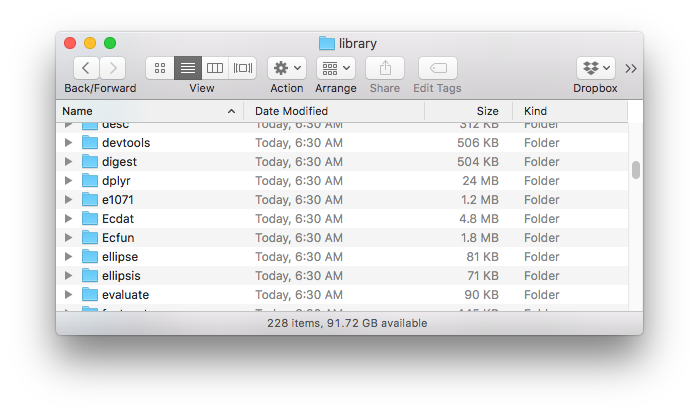

# Notes on R Packages
   
 
    
#### Jeff Jetton
Director of Analytics and Relationship Management
    
Vanderbilt University Medical Center Development
    
  
    
jeff.jetton@vumc.org
    
https://github.com/JeffJetton/r_package_notes
    
    
        
    
    
----------------
    
### What is a Package Anyway?

* A collection of one or more functions and/or data, bundled together in a specific, easy-to-distribute form
* Also includes help files and meta-data describing the package, dependencies, etc.
* Stored on your computer in a semi-compressed/compiled format (use `.Library`  or `.libPaths()` to find the location)
    + Mac: `/Library/Frameworks/R.framework/Resources/library`
    + Win (example): `C:/Program Files/R/R-3.4.0/library`
    
 
    

 
    

    
 
    
        
    
    
----------------
    
### Why write your own?

* Convenient access to your frequently-used functions (beats copy-and-pasting!)
* Collect data and analysis in one bundle
* Give back to the R community
* Getting a package up to "CRAN standards" is a worthwhile goal, whether you submit it or not
    
    
    
        
    
    
----------------
    
### A Brief Tour of `greenclust`
    
* Implements "Greenacre's Method": Hierarchical clustering of the levels of a categorical variable
    + Related to Correspondence Analysis
    + Clustering based on the similarity of the levels' distributions across another categorical variable (their "profiles")
    + As implemented, the "distance" between any two levels is taken to be the reduction in chi-squared caused by combining their contingency table rows
    + Useful for grouping levels prior to modeling (feature reduction) in a way that minimizes information loss
* Easy to do in SAS
    + Uses the standard clustering function
    + Output can be used with regular plotting and analysis functions
* Maybe not as easy in R?
    + I wasn't able to get `hclust()` to work the same way
    + FactoMineR does do a similar sort of clustering, but still not quite what I was looking for
    + Anyway, I wanted to write a package :-)
        + Lightweight
        + Compatible with `hclust()`, `plot()`, `cutree()`, etc.
        + Quick/easy to learn if you're already used to `hclust()`
* [Some demo code](greenclust-demo.R)
    
    
        
    
    
----------------

### How Do You Write a Package?

The *typical* method these days:

* All the various files are collected and kept track of in an RStudio **project**
* Special `devtools` functions (some accessible via the RStudio GUI) help take care of common development tasks such as:
    + Creating files and folder structures in the standard way
    + Generating documentation files based on specially-formatted comment blocks in your code
    + Performing various tests and checks
    + Submitting the package to CRAN
* `git` is used for version control, ideally along with a GitHub-hosted repository
    
  
    
Packages can be (and were) created "by hand"--that is, without the help of any sort of IDE or external helper packages. There is little compelling reason to do so anymore.
    
    
        
    
    
----------------

### Guidance
    
*Writing R Extensions* is the official documentation: https://cran.r-project.org/manuals.html

Probably **not** the first thing you'll want to read though! 
    
 
    

   
Best guide: *R Packages* by Hadley Wickham

* First edition (2015) available online:  http://r-pkgs.had.co.nz
* Second edition is being co-authored with Jennifer Bryan
    + Takes changes/deprecations into account
    + In-progress version online:  https://r-pkgs.org
    
Also: Take a look at github repos of your favorite R packages

* Formatting
* Conventions
* File structure, etc.
    
    
    
    
        
    
    
----------------
    
### The Three Biggest Ways a Package is Different from a Regular Project

1. Metadata
    + DOCUMENTATION file:  Package name, author, license info, etc.
    + NAMESPACE file:  Declares exposed functions and dependencies on other packages
2. Documentation
    + Help files
    + README
    + Vignettes (optional, but nice)
3. Robust, formal testing
    + `check()` (ctrl/cmd+shift+E) to ensure adherence to package conventions
    + Local unit testing with `test_that()` (ctrl/cmd+shift+T)
    + Testing on multiple environments and platforms
    
  
    
> Functions in a released package should be more tolerant of bad/unexpected input and should more gracefully handle errors than the typical function cobbled together just for personal use.
    
    
    
    
        
    
    
----------------
   
### Submitting to CRAN
    
* Set a version number (in DESCRIPTION)
* Build/check/test one last time
* Test on at least one other, different environment
    + Win-Builder: `check_win()`
    + Rhub (multiple platforms):  `check_rhub()`
    + Travis:  https://travis-ci.org
* Include a `cran-comments.md` file
    + Provides notes for the CRAN volunteer
    + Not part of the built package (add to `.Rbuildignore`)
    + List test environments you've used
    + Reiterate that there were no errors or warnings (if there were, you're not ready to submit!)
    + Explain any "notes" that you've allowed to remain
    + Resubmission? Point out the requested changes you've made
* Run `devtools::release()` to automatically submit to CRAN
    + Answer series of confirmation questions
    + Approve the confirmation email message
    + Cross fingers
    + Wait (a day or two, maybe longer)...
    
Alternatively, you can use CRAN's web submission form instead of submitting via devtools: https://cran.r-project.org/submit.html

But it's *a lot* easier to do it from the R console, with just one command...    
    
    
    
        
    
    
----------------
### Lessons Learned and Take-Aways

* Package authoring is for **any R user**.
* Don't be dissuaded by the other 15,000 out there.
    + Even if it's "been done before", there still might be a better, or easier, or usefully-different way to do it.
* Write your tests to be platform-independent!
* Having a submission sent back for changes is normal and common.
* This can be worth doing even if you don't submit. Along the way, I learned about (or strengthened knowledge of):
    + Unit testing
    + Automated testing on other platforms/environments
    + Creating thorough and "official-looking" function documentation
    + Using RStudio projects and integrating them with GitHub
    + ...all of which I will continue to use
    
    
   
